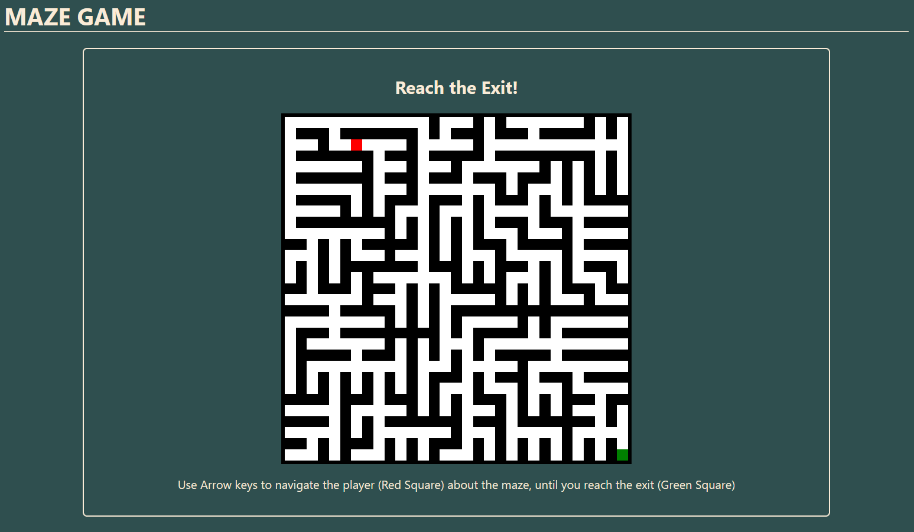
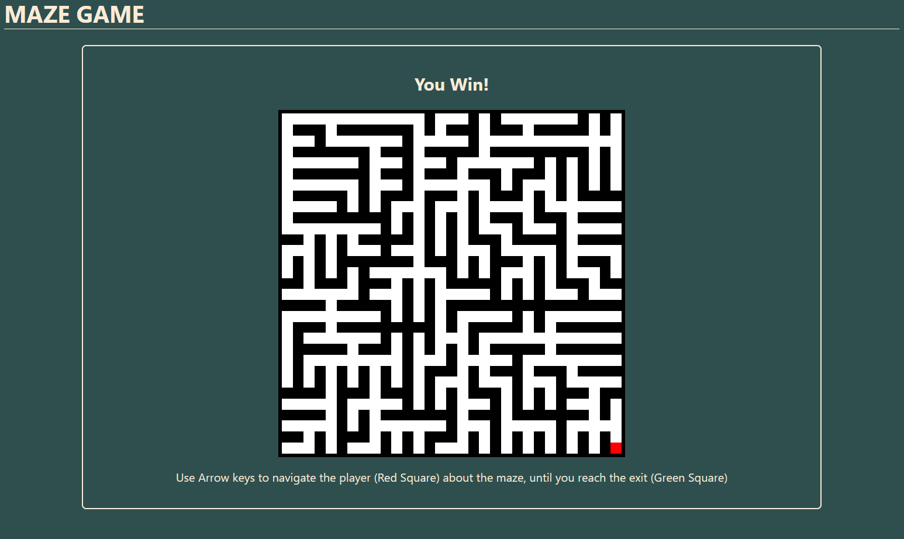

# Simple Maze Game
## About

This simple little maze game was built using the Rust library [Dioxus](https://dioxuslabs.com/). The original goal of this project was a simple excercise to brush up on my rust skills, and experiment with some of its web dev capabilities.

It generates a maze using a modified version of Prim's Minimum Spanning Tree algorithm, marking tiles as either walls, empty, or the exit. Board and game status, as well as player position are all managed using Dioxus's (react like) state management system.

The gameplay loop is just simple arrow-key navigation until the goal.

This aboslutely is not a comprehenive nor exemplary example of rust and/or disoxus's capaibilities, and there are undoubtably many expansions and improvments that could be made. This was simply a learnign excercise.

## Images





## Demo

[A short demonstration video of this project](https://www.youtube.com/watch?v=HYFAzgMTMEI)

## Development

Run the following command in the root of the project to start the Dioxus dev server:

```bash
dx serve
```

- Open the browser to http://localhost:8080